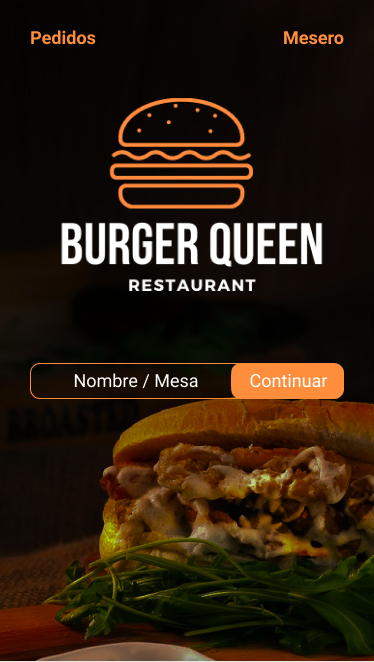
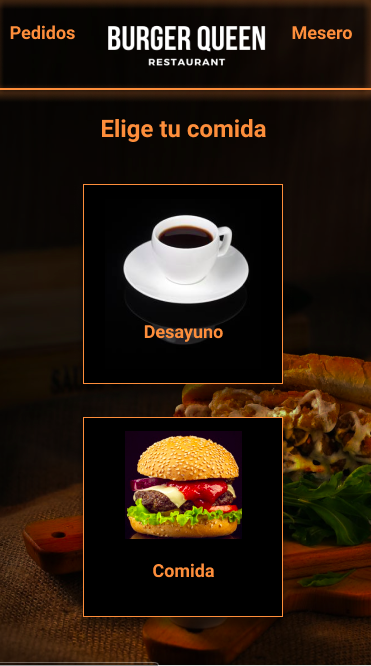
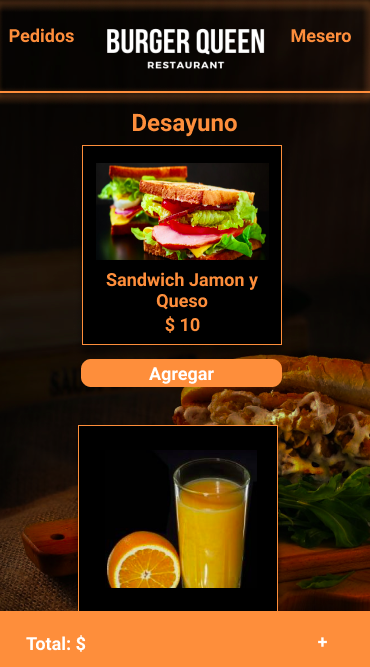
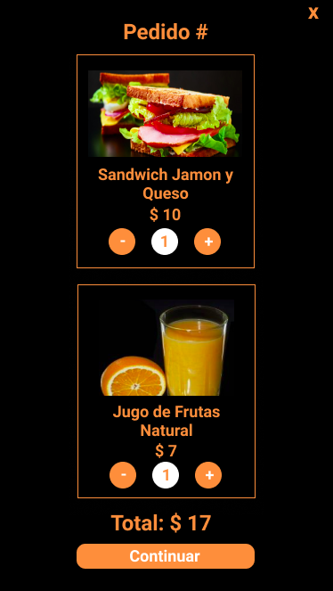
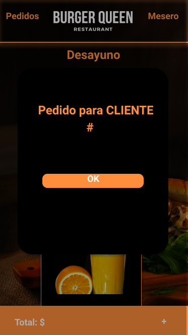

# BurgerQueen

## Índice

- [1. Resumen del proyecto](#2-resumen-del-proyecto)
- [2. Objetivos de aprendizaje](#3-objetivos-de-aprendizaje)
- [3. Consideraciones generales](#4-consideraciones-generales)
- [4. Criterios de aceptación mínimos del proyecto](#5-criterios-de-aceptación-mínimos-del-proyecto)

---

## 1. Resumen del proyecto

Un pequeño restaurante de hamburguesas, que está creciendo, necesita una
interfaz en la que puedan tomar pedidos usando una _tablet_, y enviarlos
a la cocina para que se preparen ordenada y eficientemente (a través de un
_backend_ del que nos darán detalles más adelante).

[Demo del Proyecto](https://oriananohemi.github.io/burger-queen/)

Esta es la información que tenemos del cliente:

> Somos **Burguer Queen**, una cadena de comida 24hrs.
>
> Nuestra propuesta de servicio 24hrs ha tenido muy buena acogida y, para
> seguir creciendo, necesitamos un sistema que nos ayude a tomar los pedidos de
> nuestros clientes.
>
> Tenemos 2 menús: uno muy sencillo para el desayuno:
>
> | Ítem                      | Precio \$ |
> | ------------------------- | --------- |
> | Café americano            | 5         |
> | Café con leche            | 7         |
> | Sandwich de jamón y queso | 10        |
> | Jugo de frutas natural    | 7         |
>
> Y otro menú para el resto del día:
>
> | Ítem                 | Precio |
> | -------------------- | ------ |
> | **Hamburguesas**     | **\$** |
> | Hamburguesa simple   | 10     |
> | Hamburguesa doble    | 15     |
> | **Acompañamientos**  | **\$** |
> | Papas fritas         | 5      |
> | Aros de cebolla      | 5      |
> | **Para tomar**       | **\$** |
> | Agua 500ml           | 5      |
> | Agua 750ml           | 7      |
> | Bebida/gaseosa 500ml | 7      |
> | Bebida/gaseosa 750ml | 10     |
>
> **Importante:** Los clientes pueden escoger entre hamburguesas de res,
> de pollo, o vegetariana. Además, por \$ 1 adicional, pueden agregarle queso
> o huevo.
>
> Nuestros clientes son bastante indecisos, por lo que es muy común que cambien
> el su pedido varias veces antes de finalizarlo.

### Prototipo

[Demo en Figma](https://www.figma.com/proto/9qHOuwFhD4l3RxFpAhg0w5/Burger-Queen?node-id=22%3A1&scaling=min-zoom)

[Prototipo en Figma](https://www.figma.com/file/9qHOuwFhD4l3RxFpAhg0w5/Burger-Queen)

## 2. Objetivos de aprendizaje

El objetivo principal de este proyecto es aprender a construir una _interfaz web_
usando el _framework_ elegido (React, Vue o Angular). Todos estos frameworks de
Front-end atacan el mismo problema: **cómo mantener la interfaz y el estado sincronizados**.
Así que esta experiencia espera familiarizarte con el concepto de _estado de pantalla_,
y cómo cada cambio sobre el estado se va a ir reflejando en la interfaz (por ejemplo,
cada vez que agregamos un _producto_ a un _pedido_, la interfaz debe actualizar
la lista del pedido y el total).

A continuación puedes ver los objetivos de aprendizaje de este proyecto:

### HTML y CSS

- [x] [Uso de HTML semántico.](https://developer.mozilla.org/en-US/docs/Glossary/Semantics#Semantics_in_HTML)
- [x] Uso de selectores de CSS.
- [x] Construir tu aplicación respetando el diseño realizado (maquetación).
- [x] [Uso de flexbox en CSS.](https://css-tricks.com/snippets/css/a-guide-to-flexbox/)
- [x] [Uso de Media Queries.](https://developer.mozilla.org/es/docs/CSS/Media_queries)

### JavaScript

- [x] Uso de condicionales (if-else | switch | operador ternario)
- [x] Uso de funciones (parámetros | argumentos | valor de retorno)
- [x] Manipular arrays (filter | map | sort | reduce)
- [x] Manipular objects (key | value)
- [x] Uso ES modules ([`import`](https://developer.mozilla.org/en-US/docs/Web/JavaScript/Reference/Statements/import)
      | [`export`](https://developer.mozilla.org/en-US/docs/Web/JavaScript/Reference/Statements/export))
- [x] Diferenciar entre expression y statements.
- [x] Diferenciar entre tipos de datos atómicos y estructurados.
- [x] [Uso de callbacks.](https://developer.mozilla.org/es/docs/Glossary/Callback_function)
- [x] [Consumo de Promesas.](https://scotch.io/tutorials/javascript-promises-for-dummies#toc-consuming-promises)

### Testing

- [x] [Testeo unitario.](https://jestjs.io/docs/es-ES/getting-started)

### Estructura del código y guía de estilo

- [ ] Organizar y dividir el código en módulos (Modularización)
- [ ] Uso de identificadores descriptivos (Nomenclatura | Semántica)
- [x] Uso de linter (ESLINT)

### Git y Github

- [x] Uso de comandos de git (add | commit | pull | status | push)
- [x] Manejo de repositorios de GitHub (clone | fork | gh-pages)
- [x] Colaboración en Github (branches | pull requests | |tags)
- [ ] Organización en Github (projects | issues | labels | milestones)

### Firebase

- [x] [Firestore.](https://firebase.google.com/docs/firestore)
- [x] [Firebase Auth.](https://firebase.google.com/docs/auth/web/start)
- [ ] [Firebase security rules.](https://firebase.google.com/docs/rules)
- [ ] Observadores. ([onAuthStateChanged](https://firebase.google.com/docs/auth/web/manage-users?hl=es#get_the_currently_signed-in_user)
      | [onSnapshot](https://firebase.google.com/docs/firestore/query-data/listen#listen_to_multiple_documents_in_a_collection))

### Angular

- [x] [Components & templates.](https://angular.io/guide/architecture-components#introduction-to-components)
- [x] [Directivas estructurales (ngIf / ngFor)](https://angular.io/guide/template-syntax#built-in-structural-directives)
- [x] [@Input | @Ouput](https://angular.io/guide/component-interaction#component-interaction)
- [x] [Creación y uso de servicios.](https://angular.io/guide/architecture-services#providing-services)
- [x] [Manejos de rutas.](https://angular.io/guide/router)
- [ ] [Creación y uso Observables.](https://angular.io/guide/observables-in-angular)
- [x] [Uso de HttpClient.](https://angular.io/guide/http)
- [ ] [Estilos de componentes (ngStyle / ngClass)](https://angular.io/guide/template-syntax#built-in-directives)

### UX

- [x] Diseñar la aplicación pensando y entendiendo al usuario.
- [x] Crear prototipos para obtener feedback e iterar.
- [ ] Aplicar los principios de diseño visual (contraste, alineación, jerarquía)
- [ ] Planear y ejecutar tests de usabilidad.

## 3. Consideraciones generales

La lógica del proyecto debe estar implementada completamente en JavaScript
(ES6+), HTML y CSS y empaquetada de manera automatizada.
En este proyecto Sí está permitido usar librerías o frameworks
(debes elegir entre [React](https://es.reactjs.org/), [Vue](https://vuejs.org/) o
[Angular](https://angular.io/)).

La aplicación debe ser un _Single Page App_. Los pedidos los tomaremos desde una
_tablet_, pero **no queremos una app nativa**, sino una web app que sea
**responsive** y pueda funcionar **offline**.

Necesitamos pensar bien en el aspecto UX de de quienes van a tomar los pedidos,
el tamaño y aspecto de los botones, la visibilidad del estado actual del
pedido, etc.

La aplicación desplegada debe tener 80% o más el las puntuaciones de
Performance, Progressive Web App, Accessibility y Best Practices de Lighthouse.

La aplicación debe hacer uso de `npm-scripts` y contar con scripts `start`,
`test`, `build` y `deploy`, que se encarguen de arrancar, correr las pruebas,
empaquetar y desplegar la aplicación respectivamente.

Los tests unitarios deben cubrir un mínimo del 70% de _statements_, _functions_,
_lines_ y _branches_.

Por otro lado, la parte de la interfaz no está incluida, por lo que, deberás
definir la estructura de carpetas y archivos que consideres necesaria. Puedes
guiarte de las convenciones del _framework_ elegido. Por ende, los _tests_ y el
_setup_ necesario para ejecutarlos, serán hechos por ti.

## 4. Criterios de aceptación mínimos del proyecto

### Definición del producto

El [_Product Owner_](https://www.youtube.com/watch?v=r2hU7MVIzxs&t=202s) nos
presenta este _backlog_ que es el resultado de su trabajo con el cliente hasta
hoy.

---

#### [Historia de usuario 1] Mesero/a debe poder tomar pedido de cliente

Yo como meserx quiero tomar el pedido de un cliente para no depender de mi mala
memoria, para saber cuánto cobrar, y enviarlo a la cocina para evitar errores y
que se puedan ir preparando en orden.

##### Criterios de aceptación

Lo que debe ocurrir para que se satisfagan las necesidades del usuario)

- [x] Anotar nombre de cliente.
- [x] Agregar productos al pedido.
- [x] Eliminar productos.
- [x] Ver resumen y el total de la compra.
- [x] Enviar pedido a cocina (guardar en alguna base de datos).
- [x] Se ve y funciona bien en una _tablet_

##### Definición de terminado

Lo acordado que debe ocurrir para decir que la historia está terminada.

- [x] Debes haber recibido _code review_ de al menos una compañera.
- [x] Haces _test_ unitarios y, además, has testeado tu producto manualmente.
- [x] Hiciste _tests_ de usabilidad e incorporaste el _feedback_ del usuario.
- [x] Desplegaste tu aplicación y has etiquetado tu versión (git tag).

---

#### [Historia de usuario 2] Jefe de cocina debe ver los pedidos

Yo como jefx de cocina quiero ver los pedidos de los clientes en orden y
marcar cuáles están listos para saber qué se debe cocinar y avisar a lxs meserxs
que un pedido está listo para servirlo a un cliente.

##### Criterios de aceptación

- [x] Ver los pedidos ordenados según se van haciendo.
- [x] Marcar los pedidos que se han preparado y están listos para servirse.

- [ ] Ver el tiempo que tomó prepara el pedido desde que llegó hasta que se
      marcó como completado.

##### Definición de terminado

- [x] Debes haber recibido _code review_ de al menos una compañera.
- [x] Haces _test_ unitarios y, además, has testeado tu producto manualmente.
- [x] Hiciste _tests_ de usabilidad e incorporaste el _feedback_ del usuario.
- [x] Desplegaste tu aplicación y has etiquetado tu versión (git tag).

---

#### [Historia de usuario 3] Meserx debe ver pedidos listos para servir

Yo como meserx quiero ver los pedidos que están preparados para entregarlos
rápidamente a los clientes que las hicieron.

##### Criterios de aceptación

- [x] Ver listado de pedido listos para servir.
- [x] Marcar pedidos que han sido entregados.

##### Definición de terminado

- [x] Debes haber recibido _code review_ de al menos una compañera.
- [x] Haces _test_ unitarios y, además, has testeado tu producto manualmente.
- [x] Hiciste _tests_ de usabilidad e incorporaste el _feedback_ del usuario.
- [x] Desplegaste tu aplicación y has etiquetado tu versión (git tag).
- [x] Los datos se deben mantener íntegros, incluso después de que un pedido ha terminado. Todo esto para poder tener estadísticas en el futuro.

---

## Script

**Para ejecutar el proyecto**

Puedes usar `ng serve`

Se abrira una pestaña en el browser http://localhost:4200/

**Para ejecutar los test**

Puedes usar `ng test`

**Version Angular**

Este proyecto fue creado con [Angular CLI](https://github.com/angular/angular-cli) version 10.1.2.
